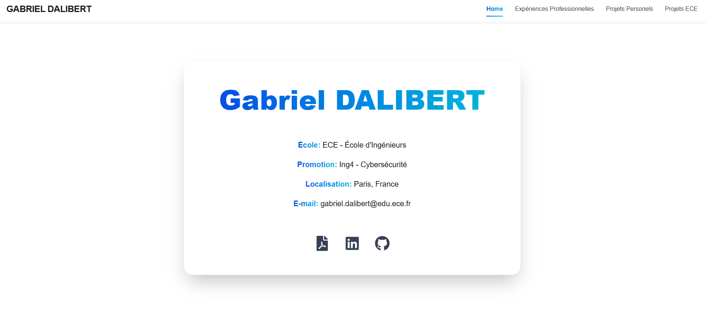
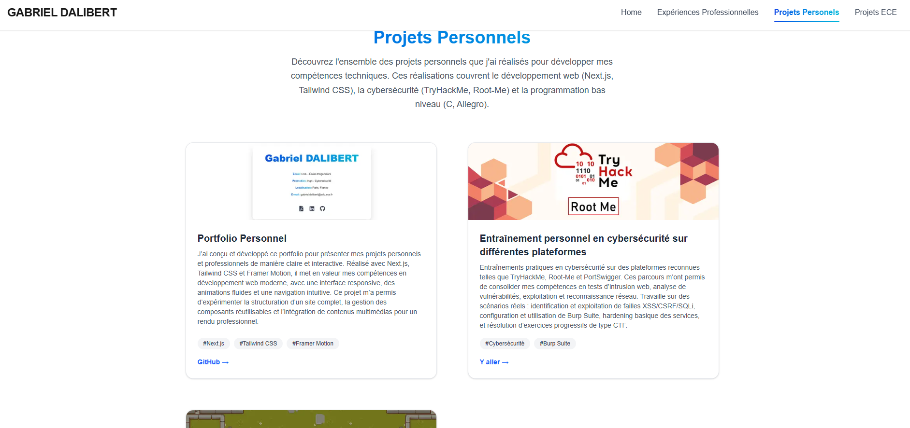

# 👨‍💻 Portfolio Personnel - Gabriel Dalibert


Bienvenue sur le repository de mon portfolio personnel. Ce projet centralise mon parcours académique à l'ECE (École d'Ingénieurs), mes expériences professionnelles et mes projets personnels en développement et cybersécurité.

**🔗 Voir le site en ligne : [site-portofolio-gabrieldalibert.vercel.app](https://site-portofolio-gabrieldalibert.vercel.app/)**

---

## 📸 Aperçu

| Accueil & Profil | Projets & Réalisations |
|:---:|:---:|
|  |  |
| *Présentation générale et spécialisation Cybersécurité* | *Vue d'ensemble des projets personnels* |

> *Le site est entièrement responsive et optimisé pour mobile.*

## 🛠 Stack Technique

Ce portfolio a été conçu avec une approche moderne, typée et performante.

* **Framework :** [Next.js](https://nextjs.org/) (React Framework pour la production)
* **Langage :** [TypeScript](https://www.typescriptlang.org/) (Pour la robustesse du code)
* **Hébergement & Déploiement :** [Vercel](https://vercel.com/) (CI/CD automatique)
* **Styling :** Tailwind

## 🚀 Fonctionnalités

Ce site n'est pas une simple page statique HTML, c'est une application React complète qui inclut :

* **Navigation SPA (Single Page Application) :** Transition fluide entre les pages Expérience, Projets ECE et Projets Perso sans rechargement.
* **Architecture Modulaire :** Séparation claire des composants (Header, Footer, Layout) pour une maintenance aisée.
* **Optimisation SEO :** Utilisation des balises sémantiques et des fonctionnalités natives de Next.js.
* **Responsive Design :** Adaptation fluide de l'interface sur desktop, tablette et mobile.

## 📂 Structure du Projet

Bien que le code source complet soit dans un repository privé pour des raisons de confidentialité, voici un aperçu de l'architecture du projet :

```text
├── app/
│   ├── components/            # Composants UI réutilisables
│   │   ├── experiences/       # Composants de contenu spécifiques
│   │   │   ├── EntrepriseContent.tsx
│   │   ├── Footer.tsx         # Code inclus
│   │   └── Header.tsx         # Code inclus
│   ├── Experience/            # Route : /Experience
│   │   ├── [slug]/            # Route Dynamique pour le détail des expériences
│   │   │   └── page.tsx
│   │   └── page.tsx           # Code inclus : Page dynamique des expériences
│   ├── ProjetECE/             
│   │   └── page.tsx
│   ├── ProjetPerso/           
│   │   ├── Plateforme/ 
│   │   │   └── page.tsx               
│   │   └── page.tsx
│   ├── data.ts                # Gestion des données statiques 
│   ├── globals.css            # Styles globaux & directives Tailwind
│   ├── layout.tsx             # Code inclus : Squelette HTML/Body commun
│   └── page.tsx               # Code inclus : Page d'accueil
├── public/                    # Assets statiques (Images, Favicon)         
├── next.config.ts             # Code inclus : Configuration Next.js (TypeScript)
└── package.json               # Code inclus : Dépendances & Scripts

## 📬 Contact

Je suis actuellement étudiant en **Ing4 - Cybersécurité** à l'ECE Paris et suis ouvert aux opportunités.

* **Email :** [gabriel.dalibert@edu.ece.fr](mailto:gabriel.dalibert@edu.ece.fr)
* **Localisation :** Paris, France

---
*© 2026 Gabriel Dalibert - Built with Next.js & TypeScript*